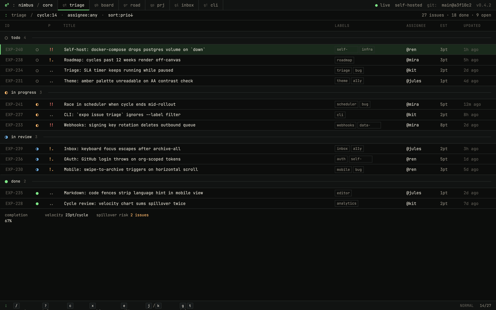
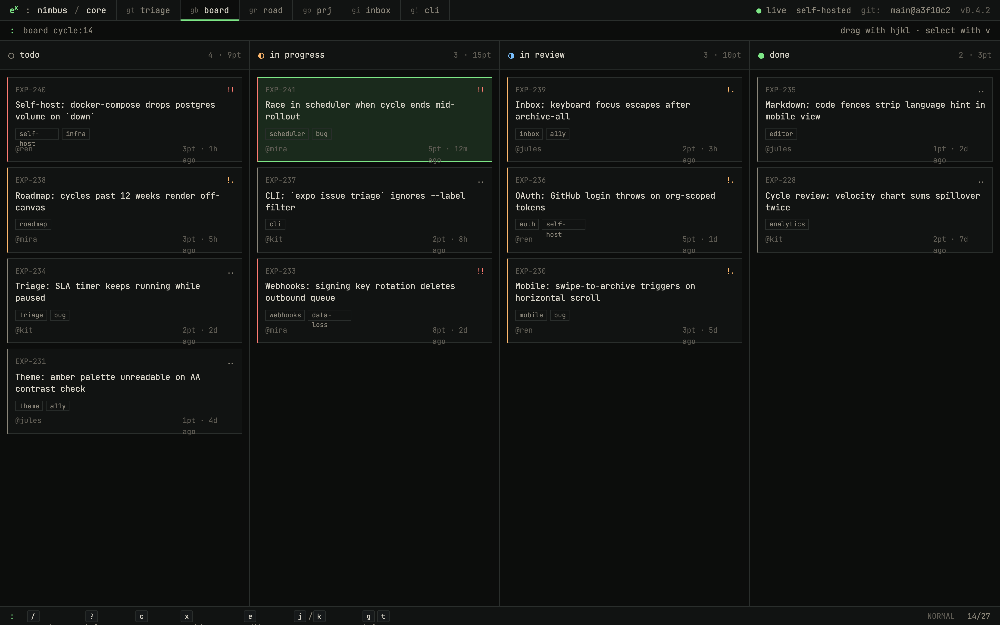
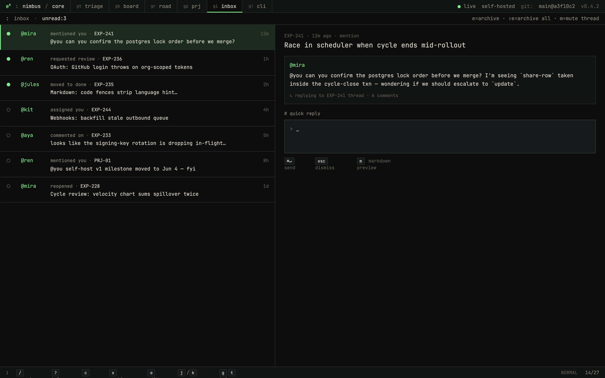
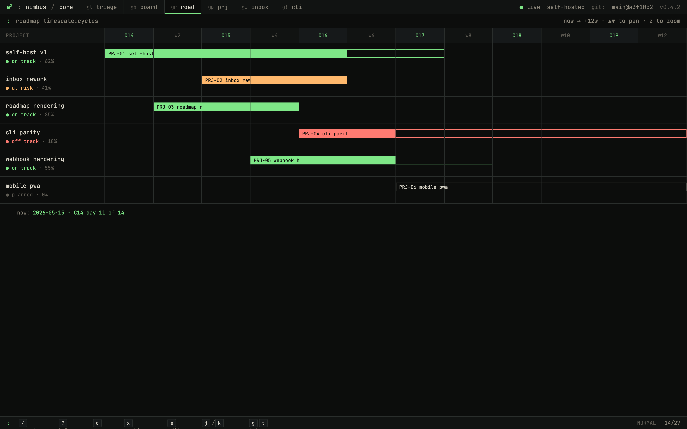

# exponential

[](https://github.com/namuh-eng/exponential)
[](LICENSE)
[](package.json)
[](docs/self-hosting.md)
[](docs/mcp.md)

**A source-available, self-hostable Linear-style issue tracker with a terminal-shaped soul.**

Create issues, plan cycles, triage inbox — entirely under your control.

---

<!-- WORKFLOW GIF PLACEHOLDER
     Replace the line below with a real recording once captured.
     Suggested tool: vhs (https://github.com/charmbracelet/vhs) or Kap (macOS).
     Capture: issue create → assign to cycle → triage inbox → resolve.
     Target: 30–60 s, 1280×720, < 5 MB.
-->


## Quickstart

> **Security:** `.env.example` ships with placeholder secrets. Set real values
> for `EXPONENTIAL_SESSION_SECRET`, `EXPONENTIAL_METRICS_TOKEN`, and
> `DB_PASSWORD` (`openssl rand -hex 32`) **before the instance accepts any
> network connections** — not only before sharing it.

Run the full stack locally (web + API + Postgres + Redis):

```bash
# Required: replace sample secrets in .env before exposing the app
git clone https://github.com/namuh-eng/exponential.git && cd exponential && cp .env.example .env && $EDITOR .env && docker compose up --build
```

> **Build time:** this compiles the full Go + Node.js stack from source
> (~15 min and ~8 GiB RAM on a typical machine). A faster image-based path
> is coming in [#634](https://github.com/namuh-eng/exponential/issues/634).

Open **http://localhost:7015** — done.

Full self-hosting guide: [docs/self-hosting.md](docs/self-hosting.md)

---

## Why exponential?

| Feature | exponential | Linear | Jira | Plane |
|---|---|---|---|---|
| **Self-hostable** | Yes — Docker Compose or ECS | No (Cloud only) | Server edition (EOL) | Yes |
| **Open / source-available** | Yes (ELv2) | No | No | Yes (AGPL) |
| **Go headless API** | Yes — OpenAPI contract + SDK | No | No | No |
| **MCP server** | Yes — hosted HTTP + local stdio | No | No | No |
| **Keyboard-first UI** | Yes — command palette + shortcuts | Yes | Limited | Limited |
| **Cycles (sprints)** | Yes | Yes | Yes (Scrum) | Yes |
| **Initiatives / roadmap** | Yes | Yes | Roadmap plugin | Yes |
| **AI integrations** | OpenAI summaries, MCP | Yes (Ask Linear) | Atlassian Intelligence | Limited |
| **CLI** | Yes (TypeScript, npm) | Limited | Limited | No |
| **License** | Elastic 2.0 — use + modify, no resale | Proprietary | Proprietary | AGPL |

## Current architecture

- Go API owns business endpoints, auth, OpenAPI strict stubs, sqlc queries, SQL
  migrations, RED metrics, and Stripe webhook processing.
- Next.js 16 web is UI-only and talks to the Go API through the generated SDK
  and same-origin `/api/*` rewrites.
- Docker Compose runs web, API, migrations, Postgres, and Redis as the default
  self-hosting path.
- AWS ECS scripts can provision and deploy split web/API services with RDS,
  ElastiCache, S3, SES, ECR, ALB routing, smoke tests, and Secrets Manager.
- Integration parity planning is tracked in
  [docs/integration-parity-roadmap.md](docs/integration-parity-roadmap.md),
  with the P0/P1/P2/P3 build order and provider issue map.

---

## What You Get

- **Issues**: list, board, priority, labels, estimates, assignees, comments,
  reactions, history, templates, bulk updates, and triage flows.
- **Projects and roadmap**: project detail, milestones, updates, labels,
  statuses, templates, progress, and roadmap views.
- **Cycles and initiatives**: sprint-style cycle planning plus strategic
  initiative grouping across projects.
- **Inbox and notifications**: assignment, mention, inbox, and notification
  settings surfaces.
- **Workspace admin**: members, invitations, security, API/OAuth applications,
  import/export, custom emoji, documents, SLA, integrations, and AI settings.
- **Keyboard-first UI**: command palette, shortcut registry, dense list/board
  views, and terminal/editorial visual direction.
- **Self-hosting controls**: Compose defaults, bind-address controls, optional
  Google/GitHub OAuth, Slack OAuth, S3 attachments, SES or Opensend email,
  metrics token, and ECS deployment scripts.
- **MCP server**: expose your exponential workspace to AI agents via the local
  stdio MCP runtime — read issues, projects, cycles, and more.

## Screenshots







---

## Self-Hosting

### Docker Compose (recommended)

```bash
git clone https://github.com/namuh-eng/exponential.git
cd exponential
cp .env.example .env

# Generate secrets — paste each value into .env
openssl rand -hex 32   # → EXPONENTIAL_SESSION_SECRET
openssl rand -hex 32   # → EXPONENTIAL_METRICS_TOKEN

$EDITOR .env
docker compose up --build
```

Open `http://localhost:7015`. The stack runs: `web`, `api`, `api-migrate`,
`postgres`, and `redis`.

See [docs/self-hosting.md](docs/self-hosting.md) for reverse-proxy headers,
bind-address controls, backups, upgrades, and optional integrations.

### AWS ECS (production)

```bash
cp .env.example .env
bash scripts/prepare-ecs-deploy-env.sh
DB_PASSWORD=<generated> bash scripts/preflight.sh
bash scripts/prepare-ecs-deploy-env.sh
RUN_PROD_SMOKE=true bash scripts/deploy-ecs.sh
```

Deploys separate API and web services behind an ALB with RDS, ElastiCache,
S3, SES, ECR, smoke tests, and Secrets Manager.

### Public Demo Instance

Public demo deployments can enable disposable guest access with
`EXPONENTIAL_PUBLIC_DEMO_ENABLED=true`. Visitors open `/api/demo/session`, which
creates a 24-hour guest browser session, seeds the deterministic
`foreverbrowsing` workspace when needed, and redirects into the Engineering demo
team.

Reset the demo workspace manually or from a nightly scheduler:

```bash
EXPONENTIAL_API_DATABASE_URL=<demo-database-url> scripts/reset-demo.sh
```

The included `Reset public demo` GitHub Action runs nightly at 09:17 UTC and
uses the `EXPONENTIAL_DEMO_DATABASE_URL` Actions secret.

The demo seed disables high-risk side effects for that workspace: attachment
uploads, inbound email, outbound integrations, OAuth app/token flows, API/PAT
creation, and billing mutations.

### Local Development

```bash
git clone https://github.com/namuh-eng/exponential.git
cd exponential
pnpm install
cp .env.example .env
docker compose -f docker-compose.dev.yml up --build
```

Web: `http://localhost:7015` · API: `http://localhost:7016`

---

## CLI and MCP

After creating a personal access token in Workspace → Settings → API, use the
CLI, hosted remote MCP endpoint, or local MCP server against the same Go API:

```bash
export EXPONENTIAL_TOKEN=pat_your_token
export EXPONENTIAL_API_URL=http://localhost:7016/v1

# CLI
pnpm --filter @namuh-eng/expn-cli cli -- issue ls --json

# Local MCP server (read-only, stdio)
pnpm --filter @exponential/mcp exec exponential-mcp
curl -H "Authorization: Bearer $EXPONENTIAL_TOKEN" \
  -H "Content-Type: application/json" \
  -d '{"jsonrpc":"2.0","id":1,"method":"tools/list"}' \
  http://localhost:7016/v1/mcp
```

- CLI docs: [docs/cli.md](docs/cli.md)
- MCP docs: [docs/mcp.md](docs/mcp.md)
- npm publishing: [docs/cli-publishing.md](docs/cli-publishing.md)

---

## Architecture

| Layer | Implementation |
|---|---|
| Web | Next.js 16, React 19, TypeScript, Tailwind, Radix UI |
| API | Go, chi, pgx, sqlc, OpenAPI strict server stubs |
| Data | PostgreSQL 15+, SQL migrations, Redis 7+ |
| Contract | `packages/proto/openapi.yaml` + generated TypeScript SDK |
| Auth | First-party Go auth, Google/GitHub OAuth, magic links, session cookies, PATs |
| Optional integrations | S3 attachments, SES/Opensend email, Slack OAuth, OpenAI summaries |
| Deployment | Docker Compose (one host) · AWS ECS Fargate (managed) |
| Validation | `make check`, `make test`, `make test-e2e`, Biome, Vitest, Go tests, Playwright |

### Repository Layout

```text
exponential/
├── apps/api/             # Go headless API and migration binary
├── apps/cli/             # TypeScript CLI over the generated SDK
├── apps/mcp/             # Local stdio MCP runtime
├── apps/web/             # Next.js UI-only app
├── packages/mcp-server/  # MCP tool package used by local clients
├── packages/proto/       # OpenAPI contract and SQL migrations
├── packages/sdk/         # Generated TypeScript SDK
├── infra/                # Dockerfiles and ECS task definitions
├── scripts/              # Validation, deploy, smoke, and generation helpers
└── docs/                 # Operator docs and architecture notes
```

---

## Development Commands

```bash
make check      # typecheck, lint/format, API build, OpenAPI, deploy guards
make test       # Go API tests + Vitest unit tests
make test-e2e   # Playwright E2E with the dev stack
make all        # check + test
make dev        # pnpm dev
make build      # production build
```

---

## License

[Elastic License 2.0 (ELv2)](LICENSE).

You may **use, modify, and self-host** exponential for any internal or personal
purpose. You may **not** offer it as a managed hosted service to third parties.

---

## Contributing

Start with [CONTRIBUTING.md](CONTRIBUTING.md). Before opening a PR:

```bash
make check
make test
```

Run `make test-e2e` before declaring browser-facing flows verified.

## Support

- [GitHub Issues](https://github.com/namuh-eng/exponential/issues)
- [GitHub Discussions](https://github.com/namuh-eng/exponential/discussions)
- [Self-hosting guide](docs/self-hosting.md)

---

Built by [Jaeyun Ha](https://github.com/jaeyunha) at Ralphthon Seoul 2026.
