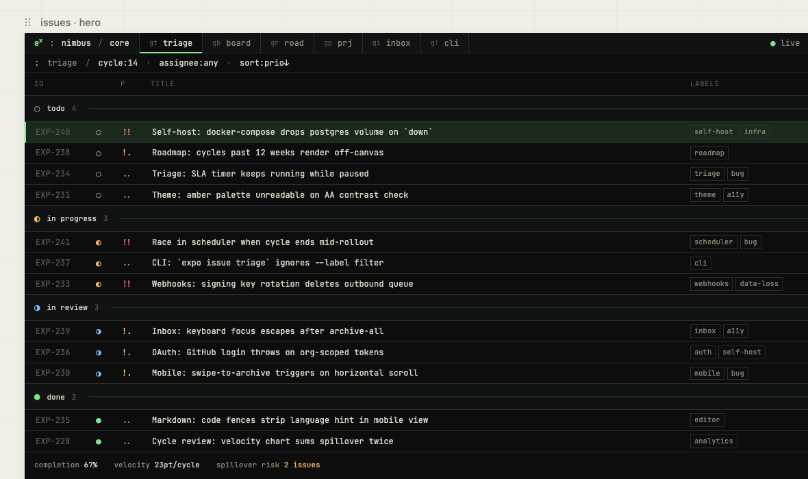

# exponential

[](https://github.com/namuh-eng/exponential)
[](LICENSE)
[](package.json)

**A source-available, self-hostable Linear-style issue tracker with a terminal-shaped soul.**

exponential is built for teams that want fast issue tracking, project planning,
cycles, initiatives, and workspace administration without giving up control of
their data. It is a split production app: a Go headless API, a Next.js web UI,
an OpenAPI contract, a generated TypeScript SDK, Postgres, and Redis.



## Current State

`v0.1.0` is the active repo version. The app has moved beyond a pure Next.js
prototype into a headless architecture:

- Go API owns business endpoints, auth, OpenAPI strict stubs, sqlc queries, SQL
  migrations, RED metrics, and Stripe webhook processing.
- Next.js 16 web is UI-only and talks to the Go API through the generated SDK
  and same-origin `/api/*` rewrites.
- Docker Compose runs web, API, migrations, Postgres, and Redis as the default
  self-hosting path.
- AWS ECS scripts can provision and deploy split web/API services with RDS,
  ElastiCache, S3, SES, ECR, ALB routing, smoke tests, and Secrets Manager.

## What You Get

- **Issues**: list, board, priority, labels, estimates, assignees, comments,
  reactions, history, templates, bulk updates, and triage flows.
- **Projects and roadmap**: project detail, milestones, updates, labels,
  statuses, templates, progress, and roadmap views.
- **Cycles and initiatives**: sprint-style cycle planning plus strategic
  initiative grouping across projects.
- **Inbox and notifications**: assignment, mention, inbox, and notification
  settings surfaces.
- **Workspace admin**: members, invitations, security, API/OAuth applications,
  import/export, custom emoji, documents, SLA, integrations, and AI settings.
- **Keyboard-first UI**: command palette, shortcut registry, dense list/board
  views, and terminal/editorial visual direction.
- **Self-hosting controls**: Compose defaults, bind-address controls, optional
  Google OAuth, Slack OAuth, S3 attachments, SES or Opensend email, metrics
  token, and ECS deployment scripts.


## Quick Start

### Self-host with Docker Compose

```bash
git clone https://github.com/namuh-eng/exponential.git
cd exponential
cp .env.example .env

# Required: replace sample secrets before exposing the app.
openssl rand -hex 32 # copy into EXPONENTIAL_SESSION_SECRET
openssl rand -hex 32 # copy into EXPONENTIAL_METRICS_TOKEN
$EDITOR .env

docker compose up --build
```

Open `http://localhost:7015`.

Read the full operator guide in [docs/self-hosting.md](docs/self-hosting.md).

### Local Development

```bash
git clone https://github.com/namuh-eng/exponential.git
cd exponential
pnpm install
cp .env.example .env
docker compose -f docker-compose.dev.yml up --build
```

The local web app runs on `http://localhost:7015`; the Go API runs on
`http://localhost:7016`.

### Headless CLI and MCP

After creating a personal access token, use the CLI and local MCP server against
the same Go API:

```bash
export EXPONENTIAL_TOKEN=pat_your_token
export EXPONENTIAL_API_URL=http://localhost:7016/v1

pnpm --filter @exponential/cli cli -- issue ls --json
pnpm --filter @exponential/mcp exec exponential-mcp
```

See [docs/cli.md](docs/cli.md) and [docs/mcp.md](docs/mcp.md).
Maintainer release notes for npm publishing live in
[docs/cli-publishing.md](docs/cli-publishing.md).

### AWS ECS Deployment

```bash
cp .env.example .env
bash scripts/prepare-ecs-deploy-env.sh
DB_PASSWORD=<generated-or-existing-password> bash scripts/preflight.sh
bash scripts/prepare-ecs-deploy-env.sh
RUN_PROD_SMOKE=true scripts/deploy-ecs.sh
```

The ECS path builds and deploys separate API and web services behind an ALB and
can run production smoke checks for web, API health, RED metrics, and an
authenticated API endpoint.

## Architecture

| Layer | Current implementation |
| --- | --- |
| Web | Next.js 16, React 19, TypeScript, Tailwind, Radix UI |
| API | Go, chi, pgx, sqlc, OpenAPI strict server stubs |
| Data | PostgreSQL 15+, SQL migrations, Redis 7+ |
| Contract | `packages/proto/openapi.yaml` plus generated SDK |
| Auth | First-party Go auth, Google OAuth, magic links, session cookies |
| Optional integrations | S3 attachments, SES or Opensend email, Slack OAuth, OpenAI summaries |
| Deployment | Docker Compose for one host; AWS ECS Fargate for managed infra |
| Validation | `make check`, `make test`, `make test-e2e`, Biome, Vitest, Go tests, Playwright |

## Repository Layout

```text
exponential/
├── apps/api/             # Go headless API and migration binary
├── apps/cli/             # TypeScript CLI over the generated SDK
├── apps/mcp/             # Local stdio MCP runtime
├── apps/web/             # Next.js UI-only app
├── packages/mcp-server/  # Read-only MCP tool package
├── packages/proto/       # OpenAPI contract and SQL migrations
├── packages/sdk/         # Generated TypeScript SDK
├── infra/                # Dockerfiles and ECS task definitions
├── scripts/              # Validation, deploy, smoke, and generation helpers
└── docs/                 # Operator docs and architecture notes
```

## Development Commands

```bash
make check      # typecheck, lint/format, API build, OpenAPI, deploy guards
make test       # Go API tests + Vitest unit tests
make test-e2e   # Playwright E2E with the dev stack
make all        # check + test
make dev        # pnpm dev
make build      # production build
```

## Self-Hosting Notes

The default self-hosted install is not a toy single container. It mirrors the
production boundary: `web`, `api`, `api-migrate`, `postgres`, and `redis`.

Configure these before sharing the instance:

- `EXPONENTIAL_SESSION_SECRET`
- `EXPONENTIAL_METRICS_TOKEN`
- `NEXT_PUBLIC_APP_URL`
- `EXPONENTIAL_APP_URL`
- `DB_PASSWORD`
- optional `AUTH_GOOGLE_ID` / `AUTH_GOOGLE_SECRET`
- optional email via SES (`SENDER_EMAIL`) or Opensend (`OPENSEND_API_KEY`)
- optional attachments via `S3_BUCKET` and AWS credentials or an instance role

See [docs/self-hosting.md](docs/self-hosting.md) for reverse proxy headers,
bind-address controls, metrics checks, backups, upgrades, and ECS.

## Contributing

Start with [CONTRIBUTING.md](CONTRIBUTING.md). Before opening a PR, run:

```bash
make check
make test
```

Run `make test-e2e` before declaring browser-facing flows verified.

## License

[Elastic License 2.0](LICENSE). You may use, modify, and self-host exponential.
You may not offer it as a hosted service to third parties.

## Support

- [GitHub Issues](https://github.com/namuh-eng/exponential/issues)
- [GitHub Discussions](https://github.com/namuh-eng/exponential/discussions)
- [Self-hosting guide](docs/self-hosting.md)

---

Built by [Jaeyun Ha](https://github.com/jaeyunha) at Ralphthon Seoul 2026.
